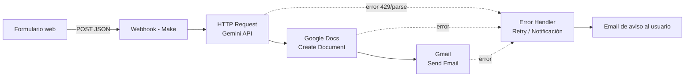

# TechCV Optimizer — Workflow

**Proyecto Final — Introducción a la Inteligencia Artificial**

Un mini SaaS que recibe la experiencia en bruto de un usuario y devuelve un CV reestructurado con impacto medible, optimizado para sistemas ATS (Applicant Tracking Systems), usando IA generativa como motor de reescritura.

🔗 **Escenario en vivo (Make):** [Ver TechCV Optimizer](https://us2.make.com/public/shared-scenario/yItxP4Oi1PD/tech-cv-optimizer)

---

## Problema

Los profesionales técnicos suelen tener currículums que listan muchas herramientas y lenguajes, pero fallan en comunicar el impacto de negocio y la proactividad, y no están optimizados para los sistemas de seguimiento de candidatos (ATS) que usan la mayoría de las empresas hoy.

## Objetivo

Construir un flujo end-to-end que tome el CV en bruto de un usuario, lo procese con un modelo de lenguaje siguiendo principios de reclutamiento moderno, y devuelva:
- Un resumen profesional reescrito con foco en el rol objetivo.
- Logros redactados con verbos de acción e impacto medible (sin inventar datos).
- Habilidades técnicas organizadas para lectura ATS.
- Recomendaciones accionables para mejorar el perfil.

Todo esto entregado automáticamente por email, junto con un documento editable en Google Docs.

---

## Arquitectura del flujo



1. **Formulario web (HTML/JS):** el usuario ingresa su email, rol objetivo, herramientas, CV actual y —opcionalmente— la descripción del puesto al que aspira.
2. **Webhook (Make):** recibe el payload y dispara el escenario.
3. **HTTP Request a Gemini API:** reescribe el CV siguiendo un prompt con reglas estrictas de formato (HTML), estilo de redacción, y una regla explícita de **no inventar métricas ni datos**.
4. **Google Docs:** genera un documento editable con el CV optimizado.
5. **Gmail:** envía el resultado al usuario con una plantilla HTML de marca.
6. **Manejadores de error:** si algún módulo falla (cuota excedida, JSON inválido, etc.), se dispara una rama alternativa que notifica al usuario en vez de dejarlo esperando en silencio.

---

## Tecnologías utilizadas

| Componente | Herramienta |
|---|---|
| Frontend / formulario | HTML, CSS, JavaScript vanilla |
| Automatización / orquestación | [Make](https://make.com) |
| Motor de IA | Gemini API (`gemini-3.6-flash`) |
| Generación de documento | Google Docs API (vía Make) |
| Envío de notificaciones | Gmail API (vía Make) |

---

## Estructura del repositorio

```
├── README.md
├── techcv-optimizer-form.html     # Formulario de ingreso de datos (frontend)
├── email-template.html            # Plantilla HTML del email de entrega
└── docs/
    └── prompt-gemini.md           # Prompt final usado en el módulo HTTP (system + user)
```

---

## Cómo probarlo

1. Abrí [`techcv-optimizer-form.html`](https://yazmintrucido.github.io/TechCV-Optimizer---Workflow/) en el navegador (publicado con GitHub Pages).
2. Completá el formulario con un email real, tu rol objetivo y pegá un CV de prueba.
3. El escenario de Make (enlazado arriba) procesa la solicitud y te devuelve un email con el CV optimizado en 1–2 minutos.

> El escenario público de Make permite ver la estructura de módulos, pero no expone las credenciales ni las API keys utilizadas.

---

## Diseño del prompt (resumen)

El prompt de IA fue iterado varias veces durante el desarrollo para evitar dos problemas comunes al reescribir CVs con LLMs:

- **Invención de métricas falsas:** se agregó una regla explícita que prohíbe fabricar cifras, porcentajes o resultados que no estén presentes en el CV original.
- **Formato inconsistente:** se forzó una salida en HTML simple (sin Markdown) para que el documento generado en Google Docs se vea correctamente formateado, sin símbolos crudos como `**` o `###`.

El prompt completo puede consultarse en [`docs/prompt-gemini.md`](docs/prompt-gemini.md).

---

## Manejo de errores

El escenario incluye manejadores de error (*error handlers*) en los módulos críticos (llamada a la IA, creación del documento, envío del email). Ante una falla, el usuario recibe un email de aviso en vez de quedar esperando indefinidamente una respuesta que nunca llegaría.

---

## Autor

Proyecto desarrollado por Yazmin Trucido asistido con Cloude AI como entrega final para la materia **Introducción a la Inteligencia Artificial**.
